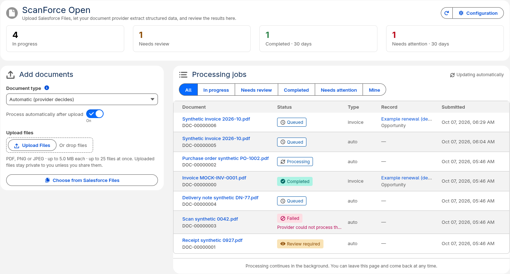
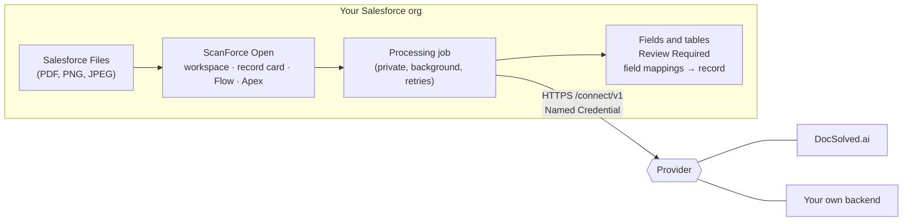
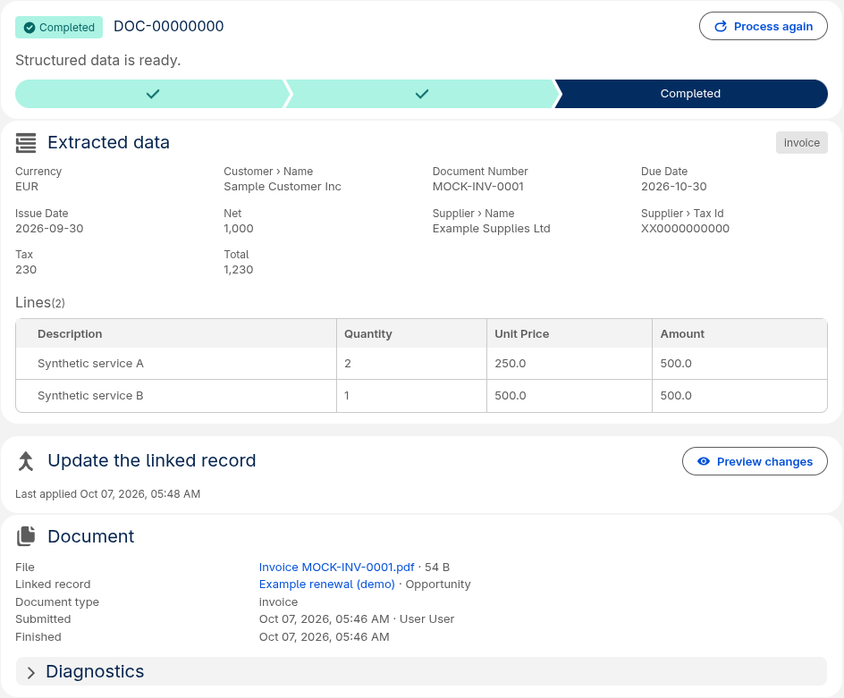
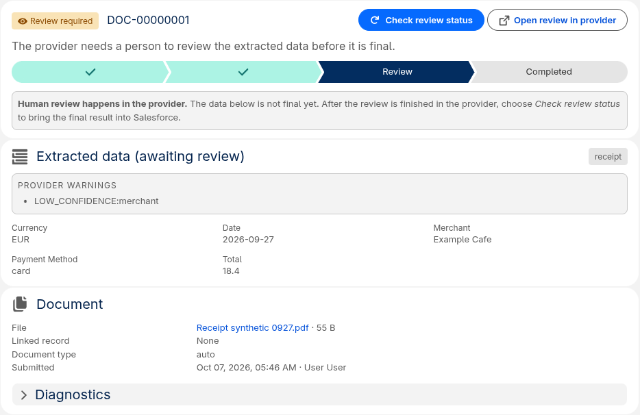

# ScanForce Open

**Open-source document intelligence workspace for Salesforce.**
**Bring your own document-processing backend or connect DocSolved.ai.**

[](https://github.com/michalTargiel91/scanforce-open/actions/workflows/ci.yml)
[](https://github.com/michalTargiel91/scanforce-open/releases/latest)
[](LICENSE)

ScanForce Open is a Salesforce app for document processing. Users upload or
pick PDFs and images stored in **Salesforce Files**. ScanForce Open sends each
one to a document-processing provider in the background, tracks its status, and
shows the extracted fields and line items. It handles **Review Required**
documents and can write values to the linked record. Flow and Apex can do the
same.

The app runs entirely in your org. OCR and extraction happen in a provider you
choose, behind a small open HTTP protocol ([`/connect/v1`](docs/provider-protocol.md)):
[DocSolved.ai](https://docsolved.ai) (hosted) or any backend you build or run
yourself.



## At a glance

| Question | Answer |
|---|---|
| What does it run on? | Your Salesforce org: Lightning app, Apex, LWC, Flow actions, custom metadata. No Connected App, integration user or public file links. |
| Do I need DocSolved.ai? | **No.** DocSolved.ai is the maintained hosted provider and the shortest path, but any service implementing `/connect/v1` works the same way. Switching is a configuration change. |
| Can I use my own backend? | Yes: three HTTPS endpoints. There is a [dependency-free reference provider](examples/mock-provider/README.md) and a [conformance checker](tools/provider-conformance/README.md). |
| How do I install it? | From source with the Salesforce CLI and one script (a few minutes, including Apex tests). See the [quickstart](docs/quickstart.md). |
| What do I need? | A Salesforce org with Lightning, Files and Apex (Developer Edition, sandbox, scratch org, or Enterprise and above), System Administrator access, Salesforce CLI, Python 3.10+, and a provider endpoint. |
| What does it cost? | ScanForce Open is free (Apache-2.0). Providers may charge for processing. |
| Where do I get help? | [Troubleshooting](docs/troubleshooting.md), then [GitHub Discussions](https://github.com/michalTargiel91/scanforce-open/discussions) or [issues](https://github.com/michalTargiel91/scanforce-open/issues/new/choose). See [SUPPORT.md](SUPPORT.md). |

## How it works



1. A user, Flow or Apex submits a File version. Access is checked **as that
   user** before anything happens.
2. A background job sends the file bytes to the provider through the
   `SfdcDcx_Provider` Named Credential. The API key stays in a Salesforce
   External Credential.
3. ScanForce Open polls until the job is **Completed**, **Review Required**,
   **Failed** or **Timed Out**. It retries safely, and duplicate submissions
   never create duplicate provider work.
4. The compact JSON result is shown as fields and tables. It can be read in
   Flow and Apex, or mapped to fields on the linked record.

Providers never receive Salesforce credentials and never call back into
Salesforce. Details: [architecture](docs/architecture.md), [security](docs/security.md).

## Quickstart

```bash
git clone https://github.com/michalTargiel91/scanforce-open.git && cd scanforce-open
sf org login web --alias my-org
bash scripts/install.sh --target-org my-org --provider docsolved
#   your own provider instead: --endpoint https://provider.example.com/connect
```

Then open **ScanForce Open → Configuration**, store the provider API key, run
**Test connection** and upload a PDF in **ScanForce Open → Workspace**.

The [quickstart guide](docs/quickstart.md) covers both provider paths. It
explains how to evaluate without a production provider by running the
reference provider on an HTTPS host, and what to expect on your first document.

## What you can do

**Users** upload files or pick existing Salesforce Files, follow jobs as they
move through *Queued → Processing → Completed*, and read the extracted data.
For **Review Required** they open the provider's review screen, then choose
**Check review status**. They can preview and apply values to the linked record.

| Completed job | Review required |
|---|---|
|  |  |

**Administrators** set up the provider on one Configuration page: endpoint,
API key, user access, recovery schedule and connection test. They manage field
mappings as custom metadata and add the **Record Documents** card to any
record page. See [configuration](docs/configuration.md).

**Developers** use five Flow actions and a small Apex API: submit, refresh,
recover, read values and apply mappings. See the [developer guide](docs/developer.md)
and the tested [examples](examples/README.md), including a ready-made
"invoices attached to an Opportunity" Flow pair.

**Provider builders** implement [`/connect/v1`](docs/provider-protocol.md),
start from the [reference provider](examples/mock-provider/README.md), and
run the [conformance checker](tools/provider-conformance/README.md) locally or in CI.

## Providers

| | DocSolved.ai | Your own provider |
|---|---|---|
| What it is | Maintained hosted document-intelligence service (OCR, classification, extraction, review screens) | Any HTTPS service implementing [`/connect/v1`](docs/provider-protocol.md): your OCR stack, a document AI product you license, another vendor |
| What you need | A DocSolved.ai workspace key with only the `connector` scope | An endpoint reachable from Salesforce over public HTTPS, plus a credential |
| Endpoint | `https://docsolved.ai/connect` | `https://your-host/connect` |
| Authentication | Bearer API key in the External Credential | Bearer key, custom header, OAuth client credentials or mTLS, all through the External Credential |
| Guide | [docs/provider-docsolved.md](docs/provider-docsolved.md) | [docs/provider-custom.md](docs/provider-custom.md) |

Both use the same Salesforce code, states and UI. Nothing in ScanForce Open is
DocSolved.ai-specific beyond a configuration preset.

## Supported files and limits

| Item | Limit |
|---|---|
| File types | PDF, PNG, JPEG |
| File size | 5 MiB (5,242,880 bytes), checked before the file is read |
| Files per submission | 25 (UI, Flow, Apex) |
| Provider response | 100 KiB compact JSON |
| Automatic processing | 15 remote attempts or 60 minutes, then *Timed Out* |
| Providers per org | One Named Credential (`SfdcDcx_Provider`) |

## Security

* User actions are authorised in **user mode** (sharing, CRUD/FLS, restriction
  rules). A linked record must be visible to the user and attached to the File.
* Processing jobs are private and read-only for everyone. Only ScanForce Open
  services change their status and results.
* Secrets live only in Salesforce External Credentials. A stored key belongs to
  its provider origin and is removed before the endpoint moves to another one.
* Provider responses are size-limited and strictly validated. Review links
  are offered only on the configured provider origin.
* No telemetry: ScanForce Open makes no outbound calls except to the provider
  you configure, and sends it only the documents you submit.

Read [docs/security.md](docs/security.md). Report vulnerabilities privately as
described in [SECURITY.md](SECURITY.md).

## Documentation

| Start here | |
|---|---|
| [Quickstart](docs/quickstart.md) | From clone to first processed document, for both provider paths |
| [Troubleshooting](docs/troubleshooting.md) | Symptoms, causes and fixes |
| [Examples](examples/README.md) | Demo invoice, Flows, Apex scripts, field mappings, record page, reference provider |

| Reference | |
|---|---|
| [Installation, upgrade, uninstall](docs/install.md) | Script and manual paths, upgrades, removal |
| [Configuration](docs/configuration.md) | Permission sets, credentials, recovery, settings |
| [User guide](docs/user-guide.md) | Using the workspace and job pages |
| [Developer guide](docs/developer.md) | Flow actions, Apex API, result format, field mappings |
| [Provider protocol `/connect/v1`](docs/provider-protocol.md) | The complete provider contract |
| [Build your own provider](docs/provider-custom.md) · [Use DocSolved.ai](docs/provider-docsolved.md) | Provider guides |
| [Architecture](docs/architecture.md) · [Security](docs/security.md) · [Recovery](docs/recovery.md) | How it works inside |
| [Testing](docs/testing.md) | Validation lanes and release checks |
| [Distribution options](docs/distribution.md) | Source, unlocked, managed and AppExchange compared |
| [Roadmap](ROADMAP.md) · [Changelog](CHANGELOG.md) | Where the project is going |

## Getting help and contributing

* **Setup questions and ideas:** [GitHub Discussions](https://github.com/michalTargiel91/scanforce-open/discussions).
* **Bugs, installation problems, provider compatibility:** [open an issue](https://github.com/michalTargiel91/scanforce-open/issues/new/choose).
  The templates say what evidence helps. Never include keys, documents
  or org IDs.
* **Security:** private reporting only. See [SECURITY.md](SECURITY.md).
* **Contributing:** [CONTRIBUTING.md](CONTRIBUTING.md) explains the local
  checks (most changes need no Salesforce org) and where to start.

ScanForce Open is maintained by [DocSolved.ai](https://docsolved.ai) (SYNAIRO
sp. z o.o.) and welcomes independent providers and contributors. It is not
affiliated with or endorsed by Salesforce.

## Development

```bash
npm ci
npm run lint && npm run format:check && npm test     # no org needed
DEV_HUB_ALIAS=my-hub bash scripts/validate-scratch.sh # scratch org deploy + all Apex tests
```

```text
force-app/            Salesforce app (the only deployable package directory)
provider-config/      one-time Named/External Credential bootstrap (placeholder URL, no secret)
examples/             demo kit, Flows, Apex scripts, field mappings, record page, reference provider
tools/                provider conformance checker
scripts/              install, validation gates, static checks
docs/                 documentation
```

Technical names use the stable `SfdcDcx_` prefix ("document connector") from
the processing core ScanForce Open is built on. They are deliberately not
renamed for branding.

## Legacy ScanForce

ScanForce Open is the open-source successor to the original ScanForce project,
which has been retired. It was rebuilt around a provider-neutral architecture
and shares no code with it. The retired managed packages (namespace `scanforce`)
are not required and not compatible. Do not install them alongside ScanForce
Open. See [migration](docs/migration-from-scanforce.md).

## License

Apache License 2.0. See [LICENSE](LICENSE) and [NOTICE](NOTICE).
