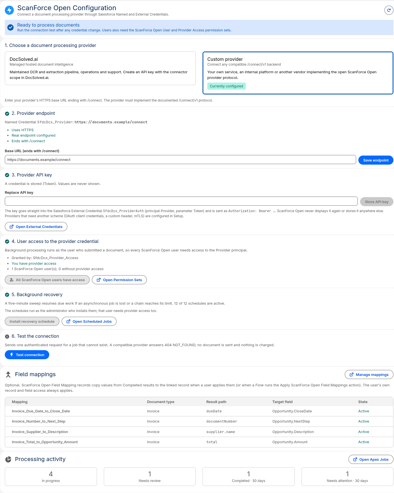

# Quickstart: from clone to first processed document

This guide takes a Salesforce administrator or developer from an empty org to
a first processed document. It has four parts:

* **A.** Install ScanForce Open in Salesforce (same for every provider).
* **B.** Connect a provider: **Option 1 — DocSolved.ai** or **Option 2 — your
  own provider**.
* **C.** Process your first document.
* **D.** Troubleshoot if something is not green.

Plan about 15 minutes once you have a provider: a DocSolved.ai key (issued on
request, so ask early) or an HTTPS endpoint. Deploying the reference provider
for a first evaluation adds about as much again.

## Before you start

| You need | Notes |
|---|---|
| A Salesforce org | Lightning Experience, Salesforce Files and Apex, API 67.0 (Summer '26) or later. A free [Developer Edition](https://developer.salesforce.com/signup), a sandbox or a scratch org is ideal for a first try. With a Dev Hub: `sf org create scratch --target-dev-hub my-hub --definition-file config/project-scratch-def.json --alias my-org --duration-days 7` (after cloning, below). |
| System Administrator access | To deploy metadata, manage Named/External Credentials, assign permission sets and schedule Apex. |
| [Salesforce CLI](https://developer.salesforce.com/tools/salesforcecli) (`sf` 2.x; CI tests with 2.151.7), Git, Bash, Python 3 | The install script is Bash and uses `python3` to read CLI output. Python 3.10+ runs the reference provider's checker and tools. |
| A provider | DocSolved.ai key **or** a `/connect/v1` endpoint on public HTTPS. You can install first and connect later. |

## A. Install in Salesforce

```bash
git clone https://github.com/michalTargiel91/scanforce-open.git
cd scanforce-open
sf org login web --alias my-org        # sandboxes: add --instance-url https://test.salesforce.com
```

Choose the line for your provider:

```bash
bash scripts/install.sh --target-org my-org --provider docsolved
bash scripts/install.sh --target-org my-org --endpoint https://provider.example.com/connect
bash scripts/install.sh --target-org my-org        # decide later (placeholder endpoint)
```

The script deploys the app with all local Apex tests, then:

* creates the Named/External Credential bootstrap only if it does not exist
  yet. It contains no secret and never overwrites an existing credential;
* assigns you **ScanForce Open Administrator** and **ScanForce Open Provider
  Access**;
* installs the five-minute recovery schedule.

It never asks for an API key. A successful run ends with:

```text
ScanForce Open is installed. Next steps:
  1. sf org open --target-org my-org --path /lightning/n/SfdcDcx_Configuration
  ...
```

On a fresh scratch org this took about two minutes. Add `--with-examples` to
also deploy the sample invoice [field mappings](../examples/field-mappings/README.md).
Manual steps, upgrades and uninstall are in [install.md](install.md).

## B. Connect a provider

Open the Configuration page:

```bash
sf org open --target-org my-org --path /lightning/n/SfdcDcx_Configuration
```



### Option 1 — DocSolved.ai

The hosted path: no infrastructure to run. Processing usage follows your
DocSolved.ai plan.

1. Get a DocSolved.ai **workspace key with only the `connector` scope**
   (`sk_docai_…`). How to request one, and what the scope allows:
   [provider-docsolved.md](provider-docsolved.md#1-get-a-docsolvedai-connector-key).
2. **Step 1:** choose **DocSolved.ai**. **Step 2:** the endpoint is
   `https://docsolved.ai/connect`; choose **Save endpoint** if it is not saved yet.
3. **Step 3:** paste the key and choose **Store API key**. It goes straight
   into the External Credential and is never shown again.
4. **Steps 4 and 5:** grant provider access and install recovery if they are
   not already green.
5. **Step 6:** **Test connection** → **Connected**.

### Option 2 — Your own provider

Any HTTPS service that implements [`/connect/v1`](provider-protocol.md) works
the same way. If you already have one, skip to step 3.

**1. Get an HTTPS endpoint.** Salesforce runs in the cloud. It can only call a
URL on the public internet with a certificate from a public certificate
authority. `http://localhost` on your laptop is **not** reachable from
Salesforce, and neither is a private network address.

To evaluate without writing a provider, run the
[reference provider](../examples/mock-provider/README.md) (synthetic results
only) on any container platform or server that gives it a public HTTPS URL:

```bash
# Build the image from the repository root
docker build -t scanforce-open-reference-provider examples/mock-provider
# Generate a random token (at least 20 characters) and keep it for step 3
python3 -c 'import secrets; print(secrets.token_urlsafe(32))'
```

Deploy the image to a host that gives it a public HTTPS URL, set the
environment variable `MOCK_PROVIDER_TOKEN` from the host's secret store, and
keep it to **one running instance**. The
[reference provider README](../examples/mock-provider/README.md#in-a-container-for-salesforce)
lists exactly what the host must do. Your base URL is then
`https://YOUR-HOST/connect`. Check it from your machine before touching
Salesforce:

```bash
export PROVIDER_TOKEN='the token from above'
python3 tools/provider-conformance/check_provider.py --base-url https://YOUR-HOST/connect --document-type invoice
# ... 12 passed, 0 warnings, 0 failed.  Conformant.
```

> The reference provider is evaluation tooling. Send it **synthetic documents
> only**, such as [`examples/demo/synthetic-invoice.pdf`](../examples/demo/README.md),
> and delete the deployment when you are done. Its results are fixed
> synthetic values; it does not read your file.

**2. Implement your own provider** when you are ready. Follow
[provider-custom.md](provider-custom.md) and check it with the same
conformance command.

**3. Configure Salesforce.** On the Configuration page:

1. **Step 1:** choose **Custom provider**. **Step 2:** enter
   `https://YOUR-HOST/connect` and choose **Save endpoint**.
2. **Step 3:** paste the provider token and choose **Store API key**. It is
   sent as `Authorization: Bearer <token>`. For a raw key in another header or
   HTTP Basic, change the External Credential in Setup instead
   ([configuration](configuration.md#authentication-schemes)).
3. **Steps 4 and 5:** grant provider access and install recovery.
4. **Step 6:** **Test connection** → **Connected**.

## C. Process your first document

1. Open **ScanForce Open → Workspace** from the App Launcher.
2. **Document type:**
   * DocSolved.ai: keep **Automatic**. The provider classifies the document.
   * Reference provider: choose **Other…** and enter `invoice` to get its
     synthetic invoice (after `--with-examples`, `invoice` is already in the
     list). Enter `review` instead to try the Review Required flow.
3. **Upload Files** and choose a PDF, PNG or JPEG of up to 5 MiB. With the
   reference provider, use only synthetic files such as
   [`examples/demo/synthetic-invoice.pdf`](../examples/demo/README.md).
4. The job appears as **Queued**, then **Processing**, then **Completed**.
   Polling starts after one minute, so the first result usually arrives
   within a few minutes. You can leave the page.
5. Open the job. **Extracted data** shows fields such as *Total* and *Supplier ›
   Name*, plus a line-item table.

**Review Required:** choose **Open review in provider**, finish the review
there, then choose **Check review status**. With the reference provider, sign
in with any user name and the token as password, then choose **Approve
synthetic result**.

**Next steps:**

* Give document users **ScanForce Open User** and **ScanForce Open Provider
  Access**. Configuration step 4 can grant Provider Access to ScanForce
  Open users who lack it, up to 200 per click.
* Put the **ScanForce Open Record Documents** card on a record page (Lightning
  App Builder). It attaches files to the record and processes them with the
  record as source.
* Map extracted values to record fields with
  [field mappings](developer.md#field-mappings). Users preview them and choose
  **Apply**. Flow can apply them automatically.
* Automate with Flow or Apex: [developer guide](developer.md) and
  [examples](../examples/README.md).

## D. If something is not green

| You see | Most likely cause | Where to look |
|---|---|---|
| *No API key stored* on Test connection | Step 3 not done, or the key was removed when the endpoint changed origin | Store the key again |
| *Authentication failed* | Wrong, revoked or under-scoped key | Provider console; store a new key |
| *Provider unreachable* | Wrong host, not public HTTPS, or untrusted certificate | Run the conformance checker from outside your network |
| *Not a /connect/v1 provider* | Base URL does not end where `/v1/jobs` starts (usually `/connect`) | Step 2 endpoint |
| Jobs stay **Queued** | No key stored, user lacks Provider Access, or recovery not installed | Test connection; steps 4–5 |

The full symptom guide is [troubleshooting.md](troubleshooting.md).
